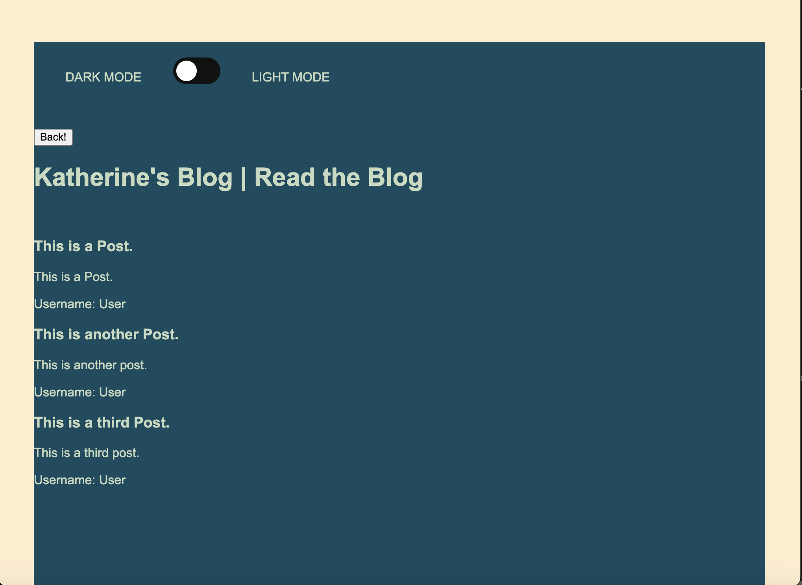
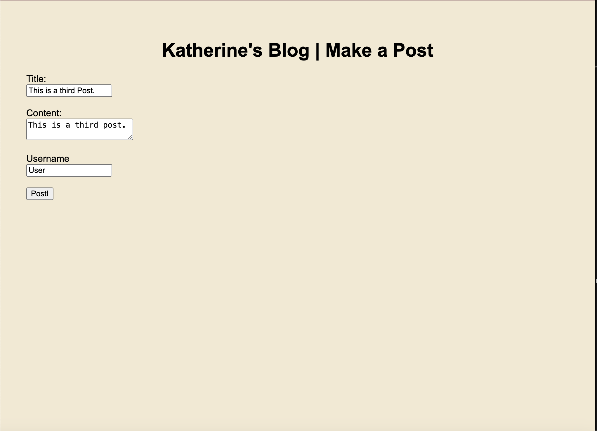

WebAPI Challenge:

The goal of this project was to create a blog platform for a marketing student using javascript, html, css and localStorage.

The blog is designed to take information from an HTML form with additional Javascript used to store the information in local storage. 

Once the blogger hits the post button, they are taking to the blog automatically, where the posts in local storage are parsed into content.

The blog has darkmode and lightmode features allowing the user to toggle between the two.

The blog also has a back button which redirects the user back to the blog post form so that they can add additional content.

!
!

https://katherinearenas.github.io/week-four-challenge-karenas/my-blog/index.html

    github-pages June 17, 2024 13:12

